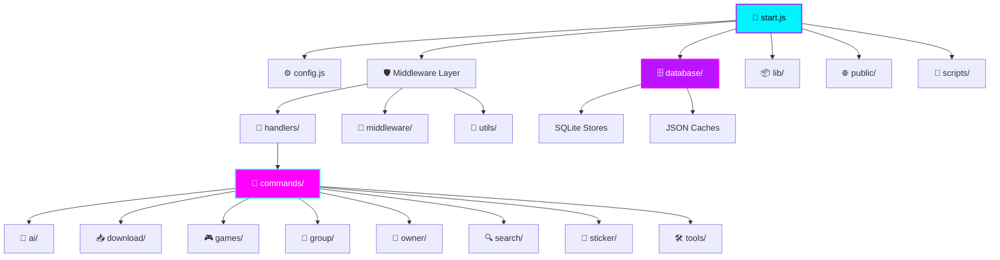

<!-- ════════════════════════════════════════════════════════════════════════ -->
<!-- ║  AUTO-GENERATED BY MAUREONIX PROTOCOL ENGINE                         ║ -->
<!-- ║  Source: README.template.md  |  DO NOT EDIT README.md DIRECTLY       ║ -->
<!-- ║  Last Sync: 2026-06-18 02:49 UTC                                           ║ -->
<!-- ╚═══════════════════════════════════════════════════════════════════════ -->

<div align="center">

<!-- ╔══════════════════════════════════════════════════════════════════════╗ -->
<!-- ║         ANIMATED HEADER — CRT SCANLINE PROTOCOL                      ║ -->
<!-- ╚══════════════════════════════════════════════════════════════════════╝ -->



<br>

<!-- ╔══════════════════════════════════════════════════════════════════════╗ -->
<!-- ║              NEURAL FOX IDENTITY — HEX FRAME                         ║ -->
<!-- ╚══════════════════════════════════════════════════════════════════════╝ -->

<a href="https://github.com/luckyfelistine-bot/maureonix">
  
</a>

<br><br>

<!-- ╔══════════════════════════════════════════════════════════════════════╗ -->
<!-- ║              TERMINAL TYPING SEQUENCES                               ║ -->
<!-- ╚══════════════════════════════════════════════════════════════════════╝ -->

<a href="https://git.io/typing-svg">
  
</a>

<br>

<a href="https://git.io/typing-svg">
  
</a>

<br>

<!-- ╔══════════════════════════════════════════════════════════════════════╗ -->
<!-- ║              DYNAMIC STATUS BADGES — LIVE DATA                       ║ -->
<!-- ╚══════════════════════════════════════════════════════════════════════╝ -->

<p align="center">
  
  
  
  
  
</p>

<p align="center">
  
  
  
  
</p>

<br>

<!-- ╔══════════════════════════════════════════════════════════════════════╗ -->
<!-- ║         SYSTEM INTEGRITY MONITOR — REAL-TIME METRICS                 ║ -->
<!-- ╚══════════════════════════════════════════════════════════════════════╝ -->

<table align="center">
  <tr>
    <td align="center"><b>📦 VERSION</b></td>
    <td align="center"><b>⌨️ COMMANDS</b></td>
    <td align="center"><b>🗂️ CATEGORIES</b></td>
    <td align="center"><b>👥 CONTRIBUTORS</b></td>
    <td align="center"><b>⏱️ UPTIME</b></td>
  </tr>
  <tr>
    <td align="center"><code>v6.0.0</code></td>
    <td align="center"><code>75</code></td>
    <td align="center"><code>8</code></td>
    <td align="center"><code>3</code></td>
    <td align="center"><code>69 days</code></td>
  </tr>
</table>

<table align="center">
  <tr>
    <td align="center"><b>⭐ STARS</b></td>
    <td align="center"><b>🔱 FORKS</b></td>
    <td align="center"><b>🔧 ISSUES</b></td>
    <td align="center"><b>👁️ WATCHERS</b></td>
    <td align="center"><b>📏 SIZE</b></td>
  </tr>
  <tr>
    <td align="center"><code>1</code></td>
    <td align="center"><code>0</code></td>
    <td align="center"><code>2</code></td>
    <td align="center"><code>1</code></td>
    <td align="center"><code>51040 KB</code></td>
  </tr>
</table>

<table align="center">
  <tr>
    <td align="center"><b>📝 LINES OF CODE</b></td>
    <td align="center"><b>🕒 LAST SYNC</b></td>
    <td align="center"><b>🧠 AI MODELS</b></td>
    <td align="center"><b>🔐 STATUS</b></td>
    <td align="center"><b>🌐 PROTOCOL</b></td>
  </tr>
  <tr>
    <td align="center"><code>44,558</code></td>
    <td align="center"><code>2026-06-18 02:49 UTC</code></td>
    <td align="center"><code>5 Active</code></td>
    <td align="center"><code>🟢 ONLINE</code></td>
    <td align="center"><code>NEURAL-NET</code></td>
  </tr>
</table>

<br>

<!-- ╔══════════════════════════════════════════════════════════════════════╗ -->
<!-- ║              SOCIAL NEURAL LINKS                                     ║ -->
<!-- ╚══════════════════════════════════════════════════════════════════════╝ -->

<p align="center">
  <a href="https://whatsapp.com/channel/0029Vb7IABxCXC3J7ZFFsk2h"></a>
  <a href="https://chat.whatsapp.com/B61mO6noiJG3wVzgkDZd4a"></a>
  <a href="https://vm.tiktok.com/ZS9LevY1LSrXD-wytcp/"></a>
  <a href="https://github.com/luckyfelistine-bot/maureonix"></a>
</p>

<br>


</div>

<br>

<!-- ════════════════════════════════════════════════════════════════════════ -->
<!-- ║                         SYSTEM BROADCAST                              ║ -->
<!-- ════════════════════════════════════════════════════════════════════════ -->

<div align="center">

> *"Maureonix is not merely a bot. She is an autonomous messaging construct — a neural engine forged in the convergence of quantum AI, multi-device architecture, and limitless extensibility. Engineered by Infinite Vybeflix, she does not respond to the future. She writes it, one protocol at a time."*

</div>

<br>

<!-- ════════════════════════════════════════════════════════════════════════ -->
<!-- ║                    SYSTEM ANALYTICS — DARK/LIGHT ADAPTIVE             ║ -->
<!-- ════════════════════════════════════════════════════════════════════════ -->

<div align="center">

## 

<br>

<a href="https://github.com/luckyfelistine-bot">
  <picture>
    <source media="(prefers-color-scheme: dark)" srcset="https://github-readme-stats.vercel.app/api?username=luckyfelistine-bot&show_icons=true&theme=midnight-purple&include_all_commits=true&count_private=true&hide_border=true&bg_color=0d0d15&title_color=00f3ff&icon_color=bc13fe&text_color=e0e0ff&ring_color=00f3ff"/>
    <source media="(prefers-color-scheme: light)" srcset="https://github-readme-stats.vercel.app/api?username=luckyfelistine-bot&show_icons=true&theme=default&include_all_commits=true&count_private=true&hide_border=true"/>
    
  </picture>
  <picture>
    <source media="(prefers-color-scheme: dark)" srcset="https://github-readme-stats.vercel.app/api/top-langs/?username=luckyfelistine-bot&layout=compact&langs_count=8&theme=midnight-purple&hide_border=true&bg_color=0d0d15&title_color=ff00ff&text_color=e0e0ff"/>
    <source media="(prefers-color-scheme: light)" srcset="https://github-readme-stats.vercel.app/api/top-langs/?username=luckyfelistine-bot&layout=compact&langs_count=8&theme=default&hide_border=true"/>
    
  </picture>
</a>

<br><br>

<a href="https://git.io/streak-stats">
  <picture>
    <source media="(prefers-color-scheme: dark)" srcset="https://streak-stats.demolab.com?user=luckyfelistine-bot&theme=cyber-streakglow&hide_border=true&background=0d0d15&ring=00f3ff&fire=ff00ff&currStreakNum=00ff9d&sideNums=bc13fe&currStreakLabel=00f3ff&sideLabels=e0e0ff&dates=666666"/>
    <source media="(prefers-color-scheme: light)" srcset="https://streak-stats.demolab.com?user=luckyfelistine-bot&theme=default&hide_border=true"/>
    
  </picture>
</a>

<br><br>

<a href="https://github.com/ashutosh00710/github-readme-activity-graph">
  <picture>
    <source media="(prefers-color-scheme: dark)" srcset="https://github-readme-activity-graph.vercel.app/graph?username=luckyfelistine-bot&bg_color=0d0d15&color=00f3ff&line=bc13fe&point=ff00ff&area=true&hide_border=true&custom_title=Neural%20Activity%20Graph"/>
    <source media="(prefers-color-scheme: light)" srcset="https://github-readme-activity-graph.vercel.app/graph?username=luckyfelistine-bot&bg_color=ffffff&color=000000&line=0066ff&point=ff00ff&area=true&hide_border=true&custom_title=Neural%20Activity%20Graph"/>
    
  </picture>
</a>

</div>

<br>

<!-- ════════════════════════════════════════════════════════════════════════ -->
<!-- ║                    TECH STACK — SKILL ICONS GRID                      ║ -->
<!-- ════════════════════════════════════════════════════════════════════════ -->

<div align="center">

## 

<br>

[](https://skillicons.dev)

</div>

<br>

<!-- ════════════════════════════════════════════════════════════════════════ -->
<!-- ║         DYNAMIC FEATURE MATRIX — AUTO-GENERATED FROM COMMANDS/      ║ -->
<!-- ════════════════════════════════════════════════════════════════════════ -->

<div align="center">

## 

<br>

<i>This matrix is automatically reconstructed from your <code>commands/</code> directory every sync cycle.</i>

<br><br>

|  |  |  |
|:---:|:---:|:---:|\n| 🛠️ **TOOLS**<br>`15 CMDs` | 🧠 **AI**<br>`12 CMDs` | 🎮 **GAMES**<br>`10 CMDs` |\n| 👥 **GROUP**<br>`9 CMDs` | 📥 **DOWNLOAD**<br>`8 CMDs` | 🎨 **STICKER**<br>`8 CMDs` |\n| 🔍 **SEARCH**<br>`7 CMDs` | 👑 **OWNER**<br>`6 CMDs` |  |

</div>

<br>


<br>

<!-- ════════════════════════════════════════════════════════════════════════ -->
<!-- ║                    SYSTEM ARCHITECTURE — MERMAID                      ║ -->
<!-- ════════════════════════════════════════════════════════════════════════ -->

<div align="center">

## 

<br>



</div>

<br>

<!-- ════════════════════════════════════════════════════════════════════════ -->
<!-- ║                    SYSTEM REQUIREMENTS                                ║ -->
<!-- ════════════════════════════════════════════════════════════════════════ -->

<div align="center">

## 

<br>

| **SOFTWARE** | **VERSION** | **STATUS** |
|:---:|:---:|:---:|
| **Node.js** | `v20+` | 🟢 **REQUIRED** |
| **Git** | `Any` | 🟢 **REQUIRED** |
| **yt-dlp** | `Latest` | 🟢 **REQUIRED** |
| **ffmpeg** | `Any` | 🟢 **REQUIRED** |
| **Python 3** | `3.9+` | 🟢 **REQUIRED** |
| **ImageMagick** | `Any` | 🟡 **OPTIONAL** |

</div>

<br>

<!-- ════════════════════════════════════════════════════════════════════════ -->
<!-- ║                    DEPLOYMENT PROTOCOLS                               ║ -->
<!-- ════════════════════════════════════════════════════════════════════════ -->

<div align="center">

## 

<br>

### 📱 Termux (Android) — Primary Uplink

```bash
pkg update && pkg upgrade -y
pkg install git nodejs-lts python ffmpeg imagemagick -y
pip install yt-dlp
git clone https://github.com/luckyfelistine-bot/maureonix.git
cd maureonix
npm install --legacy-peer-deps
node start.js
```

### 💻 Ubuntu / VPS / Dedicated Server

```bash
sudo apt update && sudo apt upgrade -y
sudo apt install git nodejs npm python3 python3-pip ffmpeg imagemagick -y
pip3 install yt-dlp
git clone https://github.com/luckyfelistine-bot/maureonix.git
cd maureonix
npm install
npm start
```

### 🤖 Auto-Deploy Script

```bash
git clone https://github.com/luckyfelistine-bot/maureonix.git
cd maureonix
bash install.sh
```

> 💡 **Neural Update Protocol:** `cd ~/maureonix && git pull origin main && pip install -U yt-dlp && node start.js`

</div>

<br>


<br>

<!-- ════════════════════════════════════════════════════════════════════════ -->
<!-- ║                    CONFIGURATION MATRIX                               ║ -->
<!-- ════════════════════════════════════════════════════════════════════════ -->

<div align="center">

## 

<br>

<i>The section below auto-extracts from your <code>config.js</code> when available, or displays the full protocol reference.</i>

<br><br>

</div>

<details>
<summary><b>🔐 CLICK TO EXPAND FULL NEURAL CONFIGURATION</b></summary>

<br>

```javascript\n// ═══════════════════════════════════════════\n// AUTO-EXTRACTED FROM config.js\n// ═══════════════════════════════════════════\n\nbotName: 'Maureonix',\nownerName: 'Infinite Vybeflix',\ngirlfriendJid: '254140562441@s.whatsapp.net',\ngirlfriendNickname: 'Dal',\nemailSender: 'iris.with.vybeflix@gmail.com',\nemailAppPassword: 'YOUR_KEY',\nemailRecipient: 'irislogs006@gmail.com',\nreportDailyTime: '0 7 * * *',\nreportWeeklyTime: '0 8 * * 1',\nresendApiKey: 'YOUR_KEY',\nfreenewsApiKey: 'YOUR_KEY',\nmaureonixPassphrase: 'Hello_Maureonix',\ngroupJid: '120363423838424989@g.us',\ngroupInviteLink: 'https://chat.whatsapp.com/BWhOCHhbXpD2tiNF9JGXqp',\nchannelLink: 'https://whatsapp.com/channel/0029Vb7IABxCXC3J7ZFFsk2h',\nchannelJid: '120363426431427396@newsletter',\ntiktokLink: 'https://vm.tiktok.com/ZS9LevY1LSrXD-wytcp/',\ngithubRepo: 'https://github.com/luckyfelistine-bot/maureonix',\ngithubToken: 'YOUR_KEY',\napiSportsKey: 'YOUR_KEY',\noddsApiKey: 'YOUR_KEY',\ngeminiApiKey: 'YOUR_KEY',\nremoveBgApiKey: 'YOUR_KEY',\nvoiceRssApiKey: 'YOUR_KEY',\napiKey: 'YOUR_KEY',\npoeApiKey: 'YOUR_KEY',\nomdbApiKey: 'YOUR_KEY',\nnumber_bot: '254116903500',\nfooter: '> *Maureonix* [BOT] | CREATED BY INFINITE VYBEFLIX',\ntempatDB: 'database.json',\ntempatStore: 'baileys_store.json',\nkey: 'YOUR_KEY',\nowner: 'Only the owner can use this command.',\nadmin: 'Only admins can use this command.',\nbotAdmin: 'The bot needs to be admin to use this command.',\ngroup: 'Use this command in groups only!',\nprivate: 'Use this command in private chat only!',\nlimit: 'You have exceeded your daily limit.',\nprem: 'This command is only for premium users.',\nwait: 'Processing, please wait...',\nerror: 'An error occurred. Please try again later.',\ndone: 'Done! ✅',\nAPIFY_TOKEN: 'YOUR_KEY',\nRAPIDAPI_KEY: 'YOUR_KEY',\nCOBALT_API: 'https://api.cobalt.tools',\nYOUTUBE_API_KEY: 'YOUR_KEY',\nVIMEO_ACCESS_TOKEN: 'YOUR_KEY',\nREDDIT_CLIENT_ID: '',\nREDDIT_CLIENT_SECRET: 'YOUR_KEY',\nSPOTIFY_CLIENT_ID: '',\n```

</details>

<br>

<!-- ════════════════════════════════════════════════════════════════════════ -->
<!-- ║                    TRANSMISSION LOG — CHANGELOG                       ║ -->
<!-- ════════════════════════════════════════════════════════════════════════ -->

<div align="center">

## 

<br>

### 🆕 QUANTUM_AI_UPGRADE
Upgraded to GPT-4o architecture. Added persistent conversation memory across sessions. New image understanding capabilities. Voice chat with natural language processing. Real-time code generation and debugging assistant.

### 🆕 HYPER_AUTOMATION_V2
Expanded from 50+ to 75+ automation toggles. Smart context-aware replies. Predictive sticker suggestions. Auto-translation with language detection. Intelligent spam filtering with ML. Scheduled message broadcasting.

### 🆕 JADIBOT_MATRIX
Revolutionary multi-user bot deployment. Users can now pair their own WhatsApp numbers and spawn personal bot instances. Instance monitoring dashboard. Resource allocation per user. Load balancing across sub-bots.

### 🆕 ENHANCED_SECURITY_LAYER
End-to-end message encryption option. Advanced keyword blocking with regex support. Auto-ban system with strike counting. IP whitelisting for owner commands. Complete audit log system. Anti-spyware detection.

### 🆕 ENTERTAINMENT_EXPANSION
New casino games: Coinflip, RPS Betting. Expanded RPG with guilds and raids. Pokémon trading system. Trivia with global leaderboards. Meme generator with custom templates. Music quiz mode.

</div>

<br>


<br>

<!-- ════════════════════════════════════════════════════════════════════════ -->
<!-- ║                    STAR HISTORY — SOCIAL PROOF                        ║ -->
<!-- ════════════════════════════════════════════════════════════════════════ -->

<div align="center">

## 

<br>

[](https://star-history.com/#luckyfelistine-bot/maureonix&Date)

</div>

<br>

<!-- ════════════════════════════════════════════════════════════════════════ -->
<!-- ║                    CONTRIBUTORS — AUTO-UPDATED                        ║ -->
<!-- ════════════════════════════════════════════════════════════════════════ -->

<div align="center">

## 

<br>

<a href="https://github.com/luckyfelistine-bot/maureonix/graphs/contributors">
  
</a>

</div>

<br>

<!-- ════════════════════════════════════════════════════════════════════════ -->
<!-- ║                    SUPPORT CHANNELS                                   ║ -->
<!-- ════════════════════════════════════════════════════════════════════════ -->

<div align="center">

## 

<br>

<a href="https://chat.whatsapp.com/B61mO6noiJG3wVzgkDZd4a"></a>
<a href="https://whatsapp.com/channel/0029Vb7IABxCXC3J7ZFFsk2h"></a>
<a href="https://github.com/luckyfelistine-bot/maureonix"></a>
<a href="https://vm.tiktok.com/ZS9LevY1LSrXD-wytcp/"></a>

</div>

<br>

<!-- ════════════════════════════════════════════════════════════════════════ -->
<!-- ║                    FOOTER SIGNATURE                                   ║ -->
<!-- ════════════════════════════════════════════════════════════════════════ -->

<div align="center">


<br>

### Crafted with ❤️ by **Infinite Vybeflix**

**© 2026 Maureonix Systems • All Neural Rights Reserved**

`LICENSE: MIT • VERSION: 6.0.0 CYBERNETIC EDITION`

<br>


</div>

<!-- ════════════════════════════════════════════════════════════════════════ -->
<!-- ║              END OF MAUREONIX PROTOCOL — ELITE EDITION                 ║ -->
<!-- ╚═══════════════════════════════════════════════════════════════════════ -->
